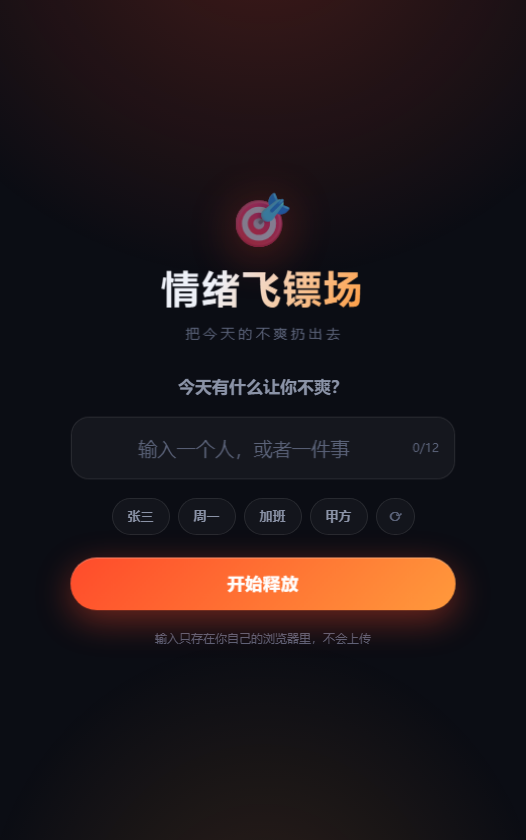
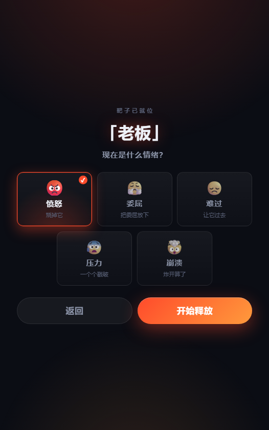
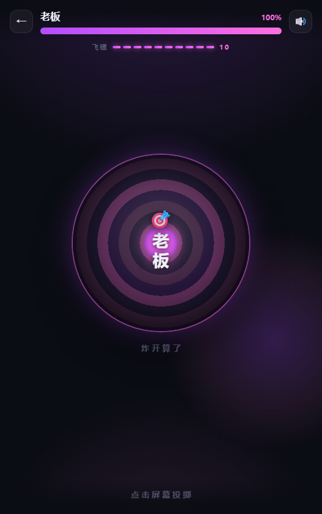
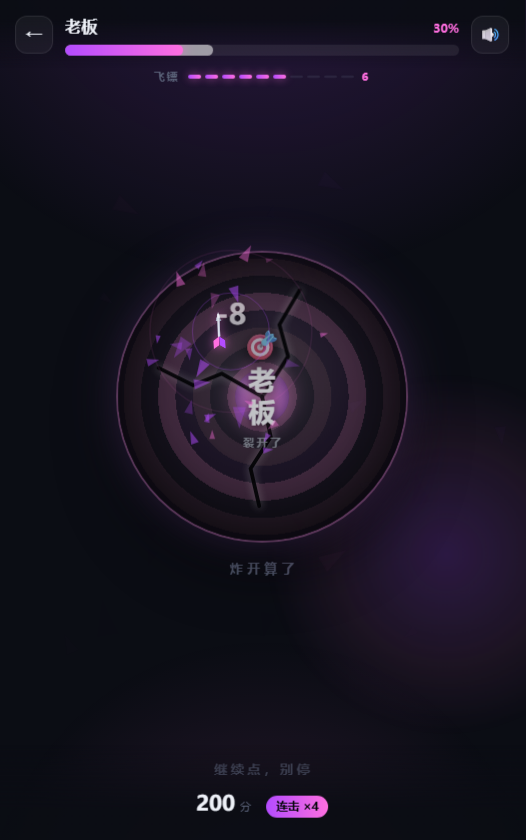
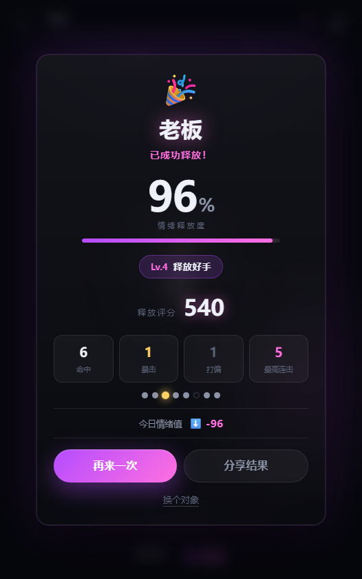
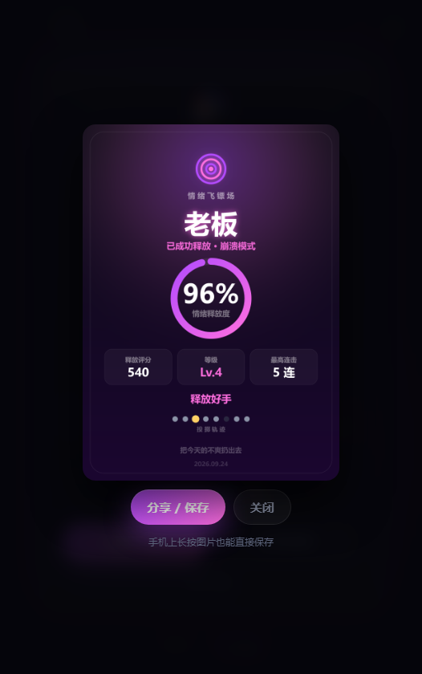

# 🎯 情绪飞镖场

> 把今天的不爽扔出去

一个把负面情绪**对象化**再打碎的轻量网页小游戏。

输入今天让你不爽的人或事 → 它变成一面靶子 → 选一种情绪 → 点击屏幕扔飞镖 → 看着它裂开、碎掉。

纯前端，无后端、无账号、**输入的每一个字都不会离开你的浏览器**。

<p align="center">
  <a href="https://vuejs.org/"></a>
  <a href="https://vite.dev/"></a>
  <a href="https://www.typescriptlang.org/"></a>
  <a href="./LICENSE"></a>
</p>

---

## 界面

<table>
  <tr>
    <td align="center" width="33%">
      <br />
      <sub><b>首页</b>　输入让你不爽的对象</sub>
    </td>
    <td align="center" width="33%">
      <br />
      <sub><b>选情绪</b>　决定配色、粒子与文案语气</sub>
    </td>
    <td align="center" width="33%">
      <br />
      <sub><b>靶子就位</b>　100 点情绪值，10 支飞镖</sub>
    </td>
  </tr>
  <tr>
    <td align="center" width="33%">
      <br />
      <sub><b>投掷</b>　命中 3 次裂开，7 次严重破坏</sub>
    </td>
    <td align="center" width="33%">
      <br />
      <sub><b>结算</b>　释放度、评分与等级</sub>
    </td>
    <td align="center" width="33%">
      <br />
      <sub><b>分享海报</b>　canvas 出图，可保存 / 系统分享</sub>
    </td>
  </tr>
</table>

---

## 玩法

1. **输入对象** —— 一个人、一件事都行（预设了「老板 / 加班 / 堵车 / 周一 / 甲方」等示例词）
2. **选一种情绪** —— 愤怒 😡 / 委屈 😤 / 难过 😞 / 压力 😰 / 崩溃 🤯
3. **点击屏幕投掷** —— 10 支飞镖打空 100 点情绪值
4. **结算** —— 释放度、评分、等级称号，一键生成分享海报

情绪不只是换个颜色：**配色、粒子形态、命中时飘出的文案全部跟着变**——
愤怒是上飘的火星，委屈是坠落的泪滴，压力是上浮后破裂的气泡，崩溃是高速旋转的碎片。

### 数值

| 判定 | 概率 | 效果 |
| --- | --- | --- |
| 普通命中 | 65% | 随机 `-8 / -12 / -15 / -20` |
| 暴击 | 10% | 固定 `-30` |
| 偏转 | 20% | 不掉血，提示「看来你已经没那么生气了」 |
| 双倍释放 | 5% | 一次两支镖，伤害与连击分别结算 |

- 连击加成 `(连击数 − 1) × 10`，单次封顶 `+100`
- 击碎靶子 `+200`，每剩一支镖 `+15`
- **释放度** = 七成看打掉多少血 + 三成看有没有打偏
- 等级门槛按实测评分分布标定（见下方「校验」），六级对应「垫底 7% / 大众 / 中位 / 前 30% / 前 5% / 前 0.2%」

---

## 跑起来

```bash
npm install
npm run dev        # http://localhost:5173
```

已开 `--host`，手机和电脑在同一局域网就能直接扫码打开玩。

```bash
npm run build      # 产物在 dist/，base 是相对路径，可直接丢静态托管
npm run preview
```

---

## 部署

### Docker 一键起

```bash
docker compose up -d --build
```

打开 **http://localhost:8080** 就能玩。换端口用 `PORT=9000 docker compose up -d`。

镜像分两阶段构建：`node:22-alpine` 里 `npm ci` + `vite build`，
再把产物拷进 `nginx:alpine`。最终镜像里没有源码、没有 node_modules，只有一个 nginx 和三个静态文件。

常用的几条：

```bash
docker compose logs -f      # 看日志
docker compose ps           # 看状态（带 healthcheck 结果）
docker compose down         # 停止并删除容器
docker compose up -d --build --force-recreate   # 改了配置强制重建
```

单跑 Dockerfile 也可以：

```bash
docker build -t emotion-dart .
docker run -d -p 8080:80 --restart unless-stopped emotion-dart
```

### 容器里做了什么

`docker/nginx.conf` 处理了四件事，都是部署静态站点时容易漏的：

- **gzip** —— JS 产物 107KB，压完 42KB
- **静态资源长缓存** —— 产物文件名带内容 hash，内容变了文件名就变，所以敢缓存一年
- **`index.html` 不缓存** —— 否则发新版本后用户手里还是旧 HTML，而它引用的旧 hash 资源可能已经被冲掉了
- **SPA 回退** —— 非静态资源路径回退到 `index.html`；但 `.js/.css/.png` 这类找不到就老实 404，避免浏览器把一段 HTML 当 JS 解析

### 拉不到基础镜像

`node:22-alpine` 和 `nginx:alpine` 要从 Docker Hub 拉。国内网络下大概率要配镜像加速，
在 Docker Desktop → Settings → Docker Engine 里加一段：

```json
{
  "registry-mirrors": ["https://docker.m.daocloud.io"]
}
```

改完重启 Docker 生效。这步和本项目无关，是拉任何公共镜像都要做的。

### 不用 Docker

产物是纯静态的，`dist/` 整个目录丢给任意静态托管（Vercel / Netlify / Cloudflare Pages / Nginx）
即可，`base` 已经配成相对路径，放子目录也能跑。

---

## 校验

三条命令，都不依赖任何测试框架：

```bash
npm run typecheck  # vue-tsc 全量类型检查
npm run smoke      # 用真实的 useGame 模块跑 4000 局，核对概率表 / 边界 / 评分区间
npm run shot       # 无头 Chrome 走完整流程并截图到 shots/，用于验收动画与排版
```

`npm run smoke` 会打印判定分布与期望值的对比 —— 因为概率这种东西肉眼看不出来，得让机器数：

```
共 4000 局 / 31705 次投掷

判定分布  实测      期望
  double     4.9%     5%   ✓
  crit        10%    10%   ✓
  miss     19.73%    20%   ✓
  hit      65.36%    65%

  等级分布
    Lv.1    5.8%  ███
    Lv.2    9.3%  ██████
    Lv.3   40.6%  ████████████████████████
    Lv.4   39.6%  ████████████████████████
    Lv.5    4.3%  ███
    Lv.6    0.2%  █

✓ 所有断言通过
```

`npm run shot` 用 Node 22 自带的 `fetch` + `WebSocket` 直接讲 CDP，没装 puppeteer ——
它会自动输入对象、选情绪、连点投掷、一路走到结算页和分享海报，顺便把控制台异常带回来。

---

## 项目结构

```
├── Dockerfile               # 两阶段构建：node 出产物 → nginx 托管
├── docker-compose.yml       # 一键起服务
├── docker/nginx.conf        # gzip / 缓存策略 / SPA 回退 / 安全响应头
│
src/
├── components/
│   ├── EmotionInput.vue     # 首页输入框 + 示例词
│   ├── EmotionPicker.vue    # 情绪选择
│   ├── TargetBoard.vue      # 靶面：同心环 + 裂纹 + 击碎动画
│   ├── Dart.vue             # 单支飞镖的飞行 / 钉住 / 坠落
│   ├── ParticleEffect.vue   # canvas 粒子层，五种情绪五种形态
│   └── ResultPanel.vue      # 结算页 + 海报预览
├── views/
│   ├── Home.vue             # 输入 → 选情绪
│   └── Game.vue             # 投掷页，只管手感不管规则
├── composables/
│   └── useGame.ts           # 全部数值判定与状态机
├── utils/
│   ├── random.ts            # 随机数工具
│   ├── storage.ts           # localStorage：历史、最高分、近 7 天汇总
│   ├── audio.ts             # Web Audio 实时合成音效
│   └── poster.ts            # canvas 画分享海报
├── data/emotions.ts         # 五种情绪的配色、粒子、文案
└── types/index.ts           # 数据模型
```

---

## 几个实现上的取舍

**音效用 Web Audio 实时合成，不加载音频文件。**
零资源体积、无加载等待、离线可用，而且每次命中的音高能带一点随机抖动，连投十下不会听腻。
`utils/audio.ts` 里合成了一整套：破空、命中、暴击、偏转、击碎、气泡破裂、完成琶音。

**飞镖是 SVG，不是 emoji。**
emoji 在不同系统上字形差异大，而且没法让镖尖跟着飞行方向转 —— 那恰恰是投掷手感的关键。
（顶栏的剩余飞镖数仍然用 emoji 表示。）

**飞镖飞行是一串纯 CSS keyframes。**
落点通过 `--dx / --dy / --spin` 三个 CSS 变量从投掷原点算偏移，
所以整段飞行不占主线程，连点时多支镖同时飞也不掉帧。

**血条按飞镖落地时间回扣，不是按下时。**
`useGame` 里立刻结算（保证连点时的规则正确），HUD 上用一个滞后的 `displayHp` 显示，
再叠一层延迟更久的白色 `hp-ghost` —— 那一段漏白是打击感的主要来源。

**连击提示只放在底部状态条上，不跟着落点飘。**
跟着落点飘会和伤害数字叠在一起，实测很难看。

**所有 localStorage 读写都包了 try/catch。**
隐私模式下静默降级，不影响游戏主流程。

**`typescript` 锁在 5.x。**
现在装出来的是 TS 7（Go 原生编译器），但 `vue-tsc` 还在通过 `typescript/lib/tsc`
这个子路径入口调编译器，TS 7 的 `exports` 里已经没有了，会直接
`ERR_PACKAGE_PATH_NOT_EXPORTED`。等 vue-tsc 适配后可以放开。

---

## 后续可做

- **AI 开场白** —— 输入「老板」后生成一句「你的老板今天成为了情绪靶子，请释放你的压力」
- **匿名情绪排行榜** —— 看看大家都在被什么困住（本地版情绪历史已经在 `utils/storage.ts` 里了）
- **账号与云同步** —— 把最近 7 天的情绪记录跨设备带走

---

## License

[MIT](./LICENSE) © 2026 ZyPLJ
